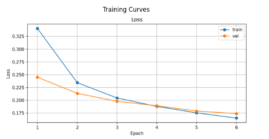
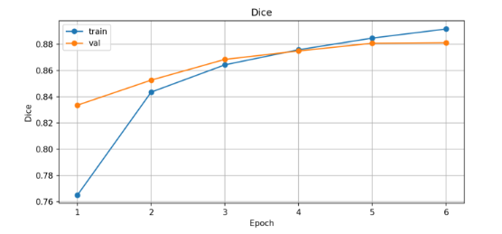
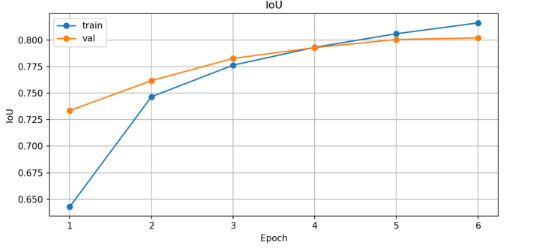
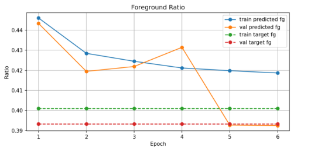
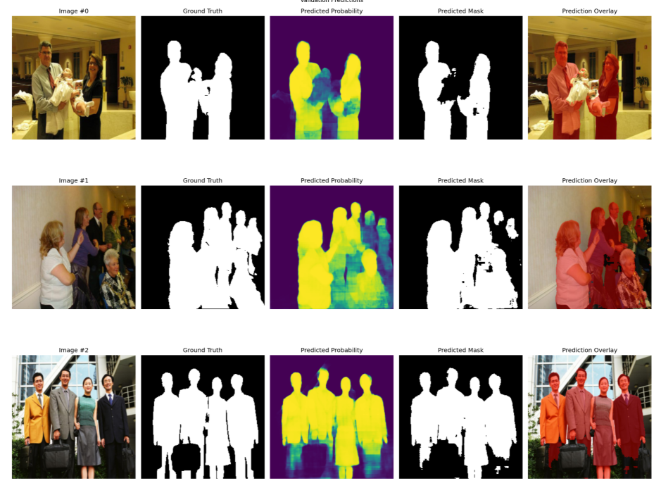

# Human Segmentation in PyTorch for Production

End-to-end human segmentation project in PyTorch with a production-oriented structure.  
The repository covers dataset preparation, preprocessing, training, evaluation, checkpointing, inference, and prediction visualization.

## Project Goal

Build a complete computer vision pipeline for **binary human semantic segmentation**, from raw dataset preparation to model training and inference.

## Problem Definition

- **Input:** RGB image
- **Output:** binary segmentation mask
  - `1` = person
  - `0` = background

The project is based on **CIHP (Crowd Instance-level Human Parsing)**, but reformulated from fine-grained human parsing into a binary human segmentation task.

## Dataset Choice

This project uses the **CIHP (Crowd Instance-level Human Parsing)** dataset as the main training benchmark.

Although CIHP is originally designed for fine-grained human parsing, this project reformulates the task into binary semantic segmentation:

- foreground (person) = `1`
- background = `0`

All human-part labels are merged into a single human class. This keeps the dataset realism and complexity while aligning the project with a production-oriented segmentation use case.

## Implemented Pipeline

The repository currently includes:

- CIHP raw data structure validation
- CIHP preprocessing into binary masks
- PyTorch `Dataset` and `DataLoader`
- Processed sample visualization
- U-Net baseline model
- Segmentation losses and metrics
  - BCE
  - BCE + Dice
  - Dice score
  - IoU
- Tiny overfit sanity check
- Baseline training loop with validation
- Best-checkpoint saving
- Checkpoint loading and prediction visualization
- Separate local, Colab, and Kaggle-oriented training configurations

## Final Training Setup

The final baseline model was trained on **Kaggle GPU (T4)** using:

- **Model:** U-Net
- **Loss:** BCE + Dice
- **Image size:** 256 × 256
- **Batch size:** 8
- **Epochs:** 6
- **Optimizer:** Adam
- **Dataset:** CIHP reformulated as binary human segmentation

## Final Results

Best validation results obtained during the Kaggle GPU training run:

- **Best epoch:** 6
- **Validation Dice:** **0.8832**
- **Validation IoU:** **0.8045**

Additional observations:

- train and validation metrics remain very close, suggesting good generalization
- predicted foreground ratio is also very close to the real foreground ratio, indicating a well-balanced segmentation behavior

## Result Visualizations

### Loss



### Dice



### IoU



### Foreground Ratio



### Validation Predictions



## Repository Structure

```text
.
├── assets/
├── configs/
├── data/
│   ├── raw/
│   ├── interim/
│   └── processed/
├── notebooks/
├── scripts/
├── src/
│   ├── api/
│   ├── data/
│   ├── inference/
│   ├── models/
│   ├── training/
│   └── utils/
├── tests/
├── outputs/
│   ├── checkpoints/
│   ├── figures/
│   ├── metrics/
│   └── predictions/
├── requirements.txt
└── README.md
